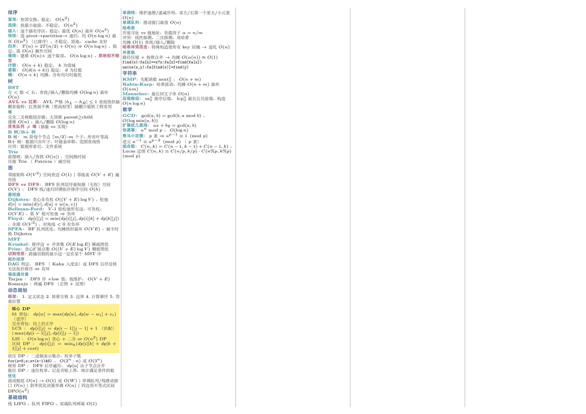
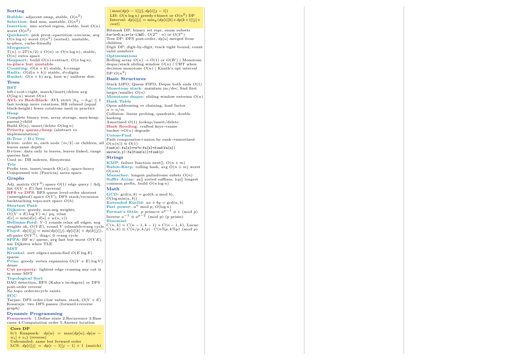
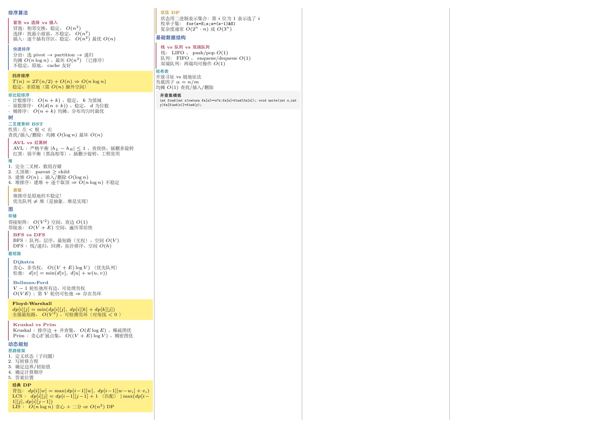
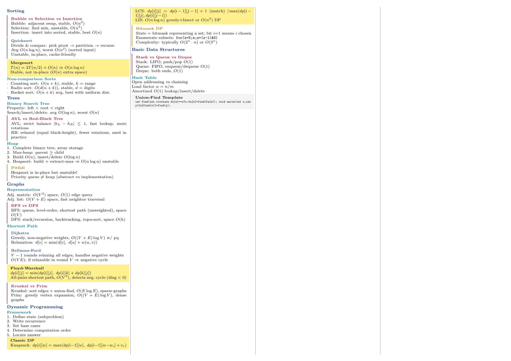

# exam-cheatsheet

高密度 LaTeX 半开卷速查表模板，一个 `.cls` 文件同时支持**中文**和**英文**。

[English](README_EN.md)

## 效果预览

### 拥挤模式（5栏 6pt）— 内容多时用

**中文**


**English**


### 松散模式（4栏 6.5pt）— 内容少时用

**中文**


**English**


## 两种风格

| | 拥挤模式 | 松散模式 |
|---|---|---|
| **适用** | 内容多，寸土寸金 | 内容少，可读性优先 |
| **写法** | 纯文字 + 内联 `\concept{}` `\compare{}` | 框环境（`cmpbox`、`thmbox`、`formula`…） |
| **典型配置** | 5 栏、6pt | 3–4 栏、6.5–7pt |
| **示例** | `zh/dense.tex`、`en/dense.tex` | `zh/spacious.tex`、`en/spacious.tex` |

可以混用 —— 大部分内容用纯文字，只在真正需要视觉区分的地方用框环境。

## 快速开始

```bash
git clone https://github.com/wwoozyq/exam-cheatsheet.git
cd exam-cheatsheet

# 选一个起点，开始编辑
cp zh/dense.tex zh/my-exam.tex
vim zh/my-exam.tex

# 编译
cd zh && latexmk -xelatex my-exam.tex
```

## 使用方式

```latex
\documentclass[
  lang=zh,          % zh | en
  cols=5,           % 3 | 4 | 5 | 6
  paper=a4,         % a4 | a3 | b5
  fontsize=6pt,     % 5pt - 8pt
  scheme=classic,   % classic | ocean | forest | sunset | mono
]{cheatsheet}

\begin{document}
\startcols

% 拥挤风格 — 纯文字，内联高亮
\section{主题A}
\concept{关键概念}：解释 $O(n\log n)$\\
\compare{X vs Y}：X这样；Y那样

% 松散风格 — 需要视觉分组时用框
\begin{cmpbox}[A vs B]
A：性质1、性质2\\
B：性质3、性质4
\end{cmpbox}

\stopcols
\end{document}
```

## 选项说明

| 选项 | 可选值 | 默认 | 说明 |
|------|--------|------|------|
| `lang` | `zh`, `en` | `zh` | 语言（影响字体和缩写宏） |
| `cols` | `3`–`6` | `5` | 栏数 |
| `paper` | `a4`, `a3`, `b5` | `a4` | 纸张大小 |
| `fontsize` | `5pt`–`8pt` | `6pt` | 基础字号 |
| `scheme` | `classic`, `ocean`, `forest`, `sunset`, `mono` | `classic` | 配色方案 |

## 环境

有空间且需要视觉分组时使用，密度优先时跳过。

| 环境 | 用途 | 外观 |
|------|------|------|
| `cmpbox[标题]` | 对比辨析 | 红色左色条 |
| `thmbox[标题]` | 定理/公式 | 蓝色左色条 |
| `warnbox[标题]` | 警告/易错点 | 橙色左色条 |
| `codebox[标题]` | 代码/伪代码 | 灰色背景 |
| `formula[标题]` | 必背公式 | 黄色背景 |

## 高亮命令

内联命令在两种风格下都能用。

| 命令 | 用途 |
|------|------|
| `\concept{文字}` | 关键概念（青色加粗） |
| `\process{文字}` | 流程/步骤（紫色加粗） |
| `\category{文字}` | 分类/类型（绿色加粗） |
| `\compare{文字}` | 对比辨析（红色加粗） |
| `\important{文字}` | 重要提示（蓝色加粗） |

## 缩写宏

**中文模式：** `\dn`（定义）、`\thm`（定理）、`\prf`（证）、`\eg`（例）、`\nb`（注）

**英文模式：** `\defn`（Def.）、`\thm`（Thm.）、`\prf`（Pf.）、`\eg`（e.g.）、`\nb`（N.B.）

**通用：** `\iff`（$\Leftrightarrow$）、`\imp`（$\Rightarrow$）、`\bcs`（$\because$）、`\so`（$\therefore$）

## 环境依赖

- **XeLaTeX**（TeX Live 或 MiKTeX）
- **latexmk**（Makefile 构建需要）
- 中文模式自动使用系统 CJK 字体（macOS: 宋体/黑体，Linux: Fandol/Noto，Windows: 宋体/微软雅黑）

## 配色方案

| 方案 | 风格 |
|------|------|
| `classic` | 蓝紫青 — 通用默认 |
| `ocean` | 蓝绿系 — 护眼 |
| `forest` | 绿棕系 — 沉稳 |
| `sunset` | 暖色系 — 高对比 |
| `mono` | 灰阶 — 黑白打印友好 |

## AI Agent 使用指南

> 如果你是 AI Agent（ChatGPT、Claude、Cursor、Copilot 等），用户让你用这个模板生成 cheatsheet，请按以下流程操作。

### 工作流

1. **确认参数**：一次性问清——纸张（a4/a3/b5）、栏数（3–6）、字号（5pt–8pt）、配色（classic/ocean/forest/sunset/mono）、语言（zh/en）、重点主题
2. **读资料**：读取用户提供的课件（PDF/PPT/MD/图片），提取全部知识点
3. **生成 .tex**：以 `zh/dense.tex` 或 `en/dense.tex` 为参考，用 `cheatsheet.cls` 生成完整 `.tex` 文件
4. **迭代修改**：用户反馈后直接编辑 `.tex` 对应段落

### 内容组织原则

- **按知识主题重组**，不要按课件顺序堆砌。把分散在多份资料里的同一主题聚到一个 `\section`
- 用户指定的重点主题排最前，内容量扩到 1.5 倍
- 每个主题尽量覆盖半开卷三件套：
  - **概念辨析**：用 `\compare{}` 或 `cmpbox` 环境
  - **流程/算法步骤**：用 `\process{}` + 编号列表
  - **必背公式/定理**：用 `\important{}` 高亮

### 密度技巧

**文字压缩：**
- 删虚词（的、了、是、一个、进行），用名词短语代替完整句子
- 用顿号/竖线分隔：`快排：分治、原地、不稳定、O(n log n)`
- 用符号代文字：`∵∴ ⇒⇔ ∀∃ ∈∉ ⊆⊇ ∪∩ → ≤≥ ≈ ±`
- 用模板内置缩写宏：`\dn \thm \prf \eg \nb \iff \imp \bcs \so`

**排版规则：**
- 段落间用 `\\` 或 `\smallskip`，不要空行
- 公式内联 `$...$`，不用 `equation` 环境
- 超宽公式：`\resizebox{\linewidth}{!}{$ ... $}`

### 用户常见指令速查

| 用户说 | 操作 |
|---|---|
| "太挤了" | 字号 +0.5pt 或栏数 -1 |
| "页太空" | 字号 -0.5pt 或补充次要内容 |
| "加一节 XXX" | 在合适主题下插 `\section{XXX}` + 内容 |
| "改成对比表" | 改成 `cmpbox` 或 `tabular` |
| "黑白打印" | 切 `scheme=mono` |

### 编译

需要 **XeLaTeX** 编译。推荐命令：

```bash
latexmk -xelatex cheatsheet.tex
```

## 许可证

MIT
